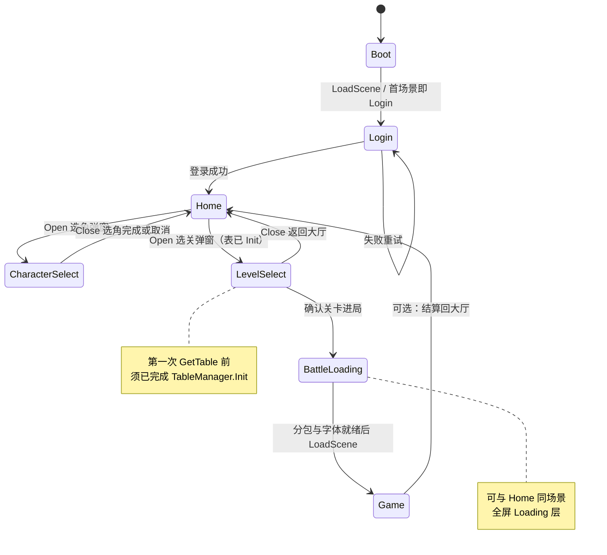

# 壳流程（登录 → Home → 选角/选关弹窗 → Loading → 局内）操作指南

面向：**Unity 工程 + 微信小游戏**（首包控制、分包、配表提前加载）。  
与当前仓库约定对齐：`TableManager` 读 `Assets/Res/Data/table_fb/*.bytes`（或 `Resources`）；局内中文用 TMP + 大字库；壳层可用系统字 + Legacy Text。

**选角、选关**：不作为独立场景，以 **UI 弹窗（面板）** 形式挂在 **Login / Home 等壳场景** 的 Canvas 下，由 `UIManager` 或等价逻辑 `Open`/`Close`（工程内可参考 `UI/Framework/UIPanelBase`）。

---

## 一、目标与原则

| 原则 | 说明 |
|------|------|
| 首包尽量小 | 壳场景 + 登录/选角/选关 UI 不引用 `msyh SDF`、不拖 TMP 大字库；少引用大表二进制（若表进分包，则首包不含 `.bytes`）。 |
| 配表尽量早 | 在**第一次** `GetTable<T>()` 之前调用 `TableManager.Instance.Init()`；选关弹窗若读 `LevelWave`/`ChapterLevel`/`Monster`，则 `Init` 须在 **打开选关弹窗之前** 完成。 |
| 字体与表解耦 | `Init` 只负责 FlatBuffer 表；TMP 中文字体在**进局前 Loading** 再加载/赋值即可。 |
| 单例常驻 | `TableManager`、后续可扩展 `Session`/`Account` 等，建议挂在 **DontDestroyOnLoad** 的 `AppRoot` 上，避免切场景丢状态。 |

---

## 二、推荐场景流（逻辑顺序）

**场景少、弹窗多**（推荐）：

```
Boot（极轻，可选）
  → Login（登录）
  → Home（大厅：Canvas 常驻；按钮打开弹窗）
        ├─ 弹窗：CharacterSelectPanel（选角）
        ├─ 弹窗：LevelSelectPanel（选关；打开前需表已 Init）
        └─ 确认进局 → BattleLoading（全屏或顶层遮罩）
              → Game（局内战斗）
```

- **Boot**：只做环境检测、版本号、微信 SDK 初始化（若需要）、跳转到 Login 或 Home。  
- **选角 / 选关**：均在 **Home（或 Login+Home 合并场景）** 内以 **UIPanel / 弹窗** 打开，不 `LoadScene` 到单独选角、选关场景。  
- **BattleLoading**：可与 Home 同场景「全屏 Loading 层」实现，或单独 `BattleLoading.unity`；内容为 `loadSubpackage`（若用）、`TableManager.Init`（若表在分包则在此之后）、加载 TMP 字体、最后 `LoadScene("Game")`。

实际可合并：例如 **Login + Home 同场景**，仅切换面板 + 弹窗栈；**流程顺序**仍按上表理解。

### 2.1 状态图（Mermaid）

下列为**逻辑状态**（可与「同一场景内仅换 UI 层」并存）。`CharacterSelect` / `LevelSelect` 表示**弹窗打开栈顶**状态，非独立 Scene。



---

## 三、Unity 编辑器内操作步骤

### 3.1 新建场景与弹窗 Prefab（建议命名）

**场景（尽量少）**

1. `Assets/Scenes/Boot.unity`（可选）  
2. `Assets/Scenes/Login.unity`（可与 Home 合并为一个壳场景）  
3. `Assets/Scenes/Home.unity`（大厅：内嵌打开选角/选关弹窗）  
4. `Assets/Scenes/BattleLoading.unity`（可选；也可做 Home 画布上的全屏 Loading 层而不单独建场景）  
5. 保留现有 **Game** 局内场景（路径以你工程为准）

**弹窗 Prefab（不单独成场景）**

1. `CharacterSelectPanel.prefab`：选角 UI，继承 `UIPanelBase`（或与现有弹窗基类一致）。  
2. `LevelSelectPanel.prefab`：选关列表/确认按钮；`OnEnable`/`Open` 里若调用 `GetTable`，须保证此前已 `TableManager.Init()`。  
3. 可选：`BattleLoadingOverlay.prefab`：全屏遮罩 + 进度条，盖在 Home 之上。

弹窗脚本目录：`Assets/Script/Game/Shell/UI/`（局外壳 / 大厅与弹窗业务脚本；与 `Common/README` 中「业务 UI 不放 Common」一致）。

### 3.2 Build Settings

1. **File → Build Settings**  
2. 将 **Boot 或 Login** 拖到列表 **Index 0**（首个启动场景）。  
3. 其余场景按加载顺序加入列表（顺序便于人工核对；真正跳转仍靠代码 `LoadScene`/`LoadSceneAsync`）。

### 3.3 常驻对象（DontDestroyOnLoad）

1. 新建空物体 prefab：`AppRoot`（或 `GameFlow`）。  
2. 挂载脚本（后续你实现）：  
   - `AppBootstrap`：首场景 `Awake` 里 `DontDestroyOnLoad(gameObject)`，负责**只执行一次**的全局初始化。  
   - 或单独将 `TableManager` 所在物体设为 `DontDestroyOnLoad`（若 `MonoSingleton` 仅在首场景存在且会随场景销毁，需改为**首场景创建并** `DontDestroyOnLoad`，避免进 Game 后丢失）。

### 3.4 壳 UI 与字体

1. 登录/选角/选关：使用 **uGUI `Text`** + **系统 `Font`**（或 `Arial.ttf` 等首包极小字体），**不要**引用 `msyh SDF`。  
2. 检查 **Prefab/Scene 无序列化引用** `ee0441c9febbf9d40a4aca56fec5e070`（msyh GUID），否则首包仍会打入大字库。

### 3.5 局内场景 Game

1. 保持现有战斗逻辑；敌人 TMP 使用 **LiberationSans SDF** 占位（prefab 不序列化引用 msyh）。  
2. **`msyh SDF`** 置于 **`Assets/Resources/Fonts/`**，由 **`BattleChineseFontRuntime`**（`BattleLoadingSceneController` 进 Game 前预加载 + **`EnemyWordLabel`** Awake/OnEnable 赋值）切换为中文字体。若需微信首包物理体积再降，勿长期依赖 Resources，应改分包/远程 AB 加载后再赋值。

### 3.6 弹窗与 `UIManager`

1. 使用工程已有 **`UI/Framework/UIPanelBase` + `UIManager`**（若已接）统一管理打开顺序、遮罩、返回键。  
2. **选关确认**后：关闭 `LevelSelectPanel` → 显示 `BattleLoadingOverlay`（或切 BattleLoading 场景）→ 资源就绪后 `LoadScene("Game")`。  
3. 弹窗栈中避免引用 `msyh SDF`；仅 Legacy `Text` + 系统字。

---

## 四、脚本与职责划分（建议）

| 模块 | 职责 |
|------|------|
| `AppBootstrap` | 首启：`DontDestroyOnLoad`、订阅微信登录回调（若用）、跳转到 Login/Home。 |
| `SceneFlowController`（或 `GameFlowStateMachine`） | 维护壳状态：`Login → Home → Loading → Game`；**选角/选关不切换场景**，只调 `UIManager.Open(...)`。 |
| `CharacterSelectPanel` / `LevelSelectPanel` | 弹窗 UI：系统字、不拖 TMP 大字库；选关内读表前假设 `Init` 已完成。 |
| `TableManager` | 保持 `Init()` 幂等；在**打开选关弹窗之前**或 **BattleLoading** 调用（见第五节）。 |
| `BattleAssetGate`（可选） | 封装：分包完成 → 字体 `TMP_FontAsset` 加载完成 → `event` 通知允许 `LoadScene(Game)`。 |
| `GameLayer` | 若 `Init` 已在外层调用，可改为：`if (!TableManager.Instance.IsInited) Init()` 作兜底（需你给 `TableManager` 加只读属性，可选）。 |

**与现有代码衔接**（当前仓库）：`TableManager.Init` 仅在 `GameLayer.Awake` 调用——壳流程落地后应**迁移**到更早的节点（见五）。

---

## 五、`TableManager.Init` 放置时机（详细）

### 5.1 若配表 `.bytes` 在首包（当前 Editor 常用：`Assets/Res/Data/table_fb`）

1. 在 **Home 场景 `Start` / `AppBootstrap`** 或 **用户点「选关」打开 `LevelSelectPanel` 之前** 调用一次 `Init()`（确保弹窗里第一次 `GetTable` 已安全）。  
2. 更早也可：在 **Login 成功进入 Home 时** 就 `Init()`（表不大时最简单）。  
3. **Game 场景**：保留或改为兜底 `Init()`，避免开发时直开 Game 场景崩溃。

### 5.2 若配表在分包（微信 `loadSubpackage` 后才有文件）

1. 在 **BattleLoading** 中：先 `loadSubpackage` → 将 `.bytes` 拷到 `persistentDataPath` 或插件约定路径 → **改 `TableManager._loadTable` 或增加从持久路径读取**（需开发一次）→ 再 `Init()`。  
2. **禁止**在分包未完成时打开 **依赖表的** `LevelSelectPanel`；或弹窗先显示「加载中」，分包 + `Init` 完成后再刷新列表（需产品接受）。

### 5.3 `mTypeList` 维护

1. 打开 `TableManager.cs`，在 `mTypeList` 中**列出所有**运行时需要的表类型（例如已有 `LexiconTable`、`LevelWave`、`Monster`；若选关要 `ChapterLevel`，则**加入并确保已导出对应 `.bytes`**）。  
2. 每增一张表：导表 → 放入 `table_fb` → 加入 `mTypeList` → 在壳流程中确认 `Init` 早于 **选关弹窗** 内第一次 `GetTable`。

---

## 六、BattleLoading（进局前）推荐步骤

按顺序执行（伪流程，便于你实现为协程 / async）：

1. **UI**：全屏遮罩 + 进度条 + 取消/重试（可选）。  
2. **微信分包**（若用）：`wx.loadSubpackage({ name: 'battle' })`，监听成功/失败。  
3. **字体资源**（若局内 TMP）：`AssetBundle` / `Addressables` / 插件 API 加载 `TMP_FontAsset`，赋给静态 holder 或 `Resources` 占位替换（按你技术选型）。  
4. **`TableManager.Init()`**（若表在分包内，须在分包就绪后）。  
5. **预加载 Game 可选**：`LoadSceneAsync("Game", LoadSceneMode.Single)`，允许 `allowSceneActivation=false` 直到进度到 0.9，再统一激活，减少黑屏。  
6. **进入 Game 后**：`SpawnerWaves` / 刷怪逻辑应保证在 **字体与表就绪** 之后（可用事件或 `BattleAssetGate.IsReady`）。

### 6.1 工程内已实现（占位）

| 脚本 | 路径 | 说明 |
|------|------|------|
| `BattleFlowLauncher` | `Assets/Script/Game/App/BattleLoading/BattleFlowLauncher.cs` | 校验 `SelectedLevelContext`，`CloseTop` 后 `LoadSceneAsync("BattleLoading")`。 |
| `BattleLoadingSceneController` | `Assets/Script/Game/App/BattleLoading/BattleLoadingSceneController.cs` | 场景内协程：分包占位 → 可选 `TableManager.Init` → `LoadSceneAsync(Game)`（`allowSceneActivation` 分段）。未拖 UI 时自动生成最简 Canvas + 重试按钮。 |
| `WeChatSubpackagePlaceholder` | `Assets/Script/Game/App/BattleLoading/WeChatSubpackagePlaceholder.cs` | 编辑器模拟延迟；WebGL 未接插件时视为成功，避免卡死；接 SDK 后替换 `#elif UNITY_WEBGL` 分支。 |
| `BattleChineseFontRuntime` | `Assets/Script/Game/App/BattleChineseFontRuntime.cs` | `Resources.Load("Fonts/msyh SDF")`；壳 prefab 无 msyh 序列化引用；`BattleLoading` 与 `EnemyWordLabel` 调用。 |

`LevelSelectPanel` 上可配置 **「进局」按钮** 绑定 `BattleFlowLauncher.TryStartBattleLoading()`；`BattleLoading` 场景已挂 `BattleLoadingController`（见 `Assets/Scenes/BattleLoading.unity`），且 **Build Settings** 须包含 `BattleLoading` 与 `Game`。

---

## 七、微信小游戏侧（与 Unity 的对应）

1. **分包配置**：在导出工程 `game.json`（或插件面板）中声明分包名，例如 `battle`，与 Unity 里 `loadSubpackage` 名称一致。  
2. **首包资源**：用微信开发者工具「代码依赖分析」看首包体积；确认壳层 **Prefab/场景无 msyh 序列化引用**（GUID `ee0441c9…`）；大字库若放 `Resources` 仍会进 Player 数据包，极致压首包需远程 AB/分包。
3. **测试顺序**：开发者工具先关分包模拟失败 → 再开正常分包；真机弱网测 Loading 与重试。

---

## 八、验收检查清单（自检用）

- [ ] Build Settings 首场景为 Boot 或 Login。  
- [ ] 壳场景 + **选角/选关弹窗 Prefab** 内无 `msyh` / 无 TMP 大字库引用链。  
- [ ] 任意 `GetTable` 调用点之前已执行 `Init`（含弹窗 `OnEnable`，全局搜索 `GetTable` 核对）。  
- [ ] `ChapterLevel` 等选关用表已在 `mTypeList` 且 `.bytes` 存在。  
- [ ] BattleLoading：分包失败有提示，不进入 Game。  
- [ ] 直开 Game 场景调试：`Init` 仍有兜底或明确报错提示。  
- [ ] 选角/选关仅通过 `UIManager`（或统一入口）打开/关闭，无多余 `LoadScene`。

---

## 九、建议实施顺序（减少返工）

1. 加 **`AppRoot`（`DontDestroyOnLoad`）+ 最简 SceneFlow**（例如：Login → Home，再 `LoadScene(Game)` 调试通），验证切场景与单例。  
2. 把 **`TableManager.Init` 从 `GameLayer` 挪到 Home 进线或打开选关弹窗前**（并保留 Game 兜底）。  
3. 做 **Home + `CharacterSelectPanel` / `LevelSelectPanel` 弹窗 Prefab**（`UIManager` 打开），只系统字、无 msyh。  
4. 加 **BattleLoading**（遮罩或场景）+ 微信分包占位逻辑。  
5. 最后做 **真登录** 与存档。

---

## 十、文档与工程规范

- 架构边界仍遵守 `Assets/Script/Game/Common/README.md`（Common 不写业务 UI 逻辑；壳流程脚本可放 `Script/Game/App/` 或 `Script/Game/Bootstrap/`）。  
- 本指南路径：`docs/壳流程操作指南.md`，随流程变更请同步修订「第二节、第五节、第八节」。  
- **Home 大厅、页签、弹窗与选关落地**：见 `docs/Home场景规划.md`（与 `UIManager` / `HomeHubController` / `LevelSelectPanel` 对齐）。

---

*版本：与当前仓库 TableManager / 微信小游戏讨论结论一致；实现细节以你选用的微信 Unity 插件文档为准。*
